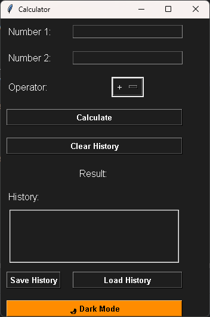
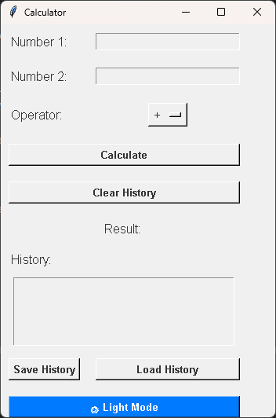

---

# 🎉 **Calculator Project** 🧮

## 🚀 **Overview**

Welcome to the **Calculator Project**! This interactive calculator app is built using **Python**, featuring:

- **GUI** with **Tkinter**.
- **Sound effects** using **pygame**.
- **Light and Dark themes** for a better user experience.

This calculator supports essential arithmetic operations such as **Addition**, **Subtraction**, **Multiplication**, and **Division**.

    
*Above is the Calculator's GUI Interface.*

## 🌟 **Features**

- ➕ **Basic arithmetic operations**: Add, subtract, multiply, and divide.
- 🖥️ **Interactive GUI** powered by **Tkinter**.
- 🎶 **Sound effects** for each button click, powered by **pygame**.
- 🌈 **Light and Dark themes** to switch between a brighter or darker interface.

## 🛠️ **Installation Guide**

### **1. Prerequisites**

Make sure you have **Python 3.x** installed on your system. Download it from the [official Python website](https://www.python.org/downloads/).

### **2. Setup the Project**

Clone the repository:

```bash
git clone https://github.com/your-username/calculator.git
```

Navigate to the project folder:

```bash
cd calculator
```

Create a virtual environment:

```bash
python -m venv .venv
```

Activate the virtual environment:
- **For Windows**:
  ```bash
  .venv\Scripts\activate
  ```

Install the required dependencies:

```bash
pip install -r requirements.txt
```

### **3. Dependencies**

- **pygame**: For sound effects.
- **tkinter**: For the graphical user interface (GUI).

## 🚀 **Running the Calculator**

To run the calculator, use the following command:

```bash
python Calc.py
```

This will launch the calculator with a simple, user-friendly interface.

---

## 🔊 **Sound Effects**

Make sure you have the **`click.wav`** sound file in the same directory as `Calc.py` for the button click sound to work.

---

## 💡 **Themes**

- 🌞 **Light Theme**: The default theme with bright, easy-to-read colors.
- 🌚 **Dark Theme**: A more relaxed, dark-themed interface that reduces eye strain in low-light conditions.

### **Switching Themes**

To toggle between **Light** and **Dark** themes:
- A button in the UI allows you to switch themes dynamically.
- The background and button colors will change accordingly to provide a smooth transition.

---

## 📝 **Usage**

- 🔢 Click number buttons to enter digits.
- ➗ Use operation buttons (`+`, `-`, `*`, `/`) to perform calculations.
- 🟰 Click the `=` button to get the result.
- ❌ Click the `C` button to clear the current input.
- 🔈 Toggle sound effects using the sound icon.
- 🌞 Switch between **Light** and **Dark** themes using the theme toggle button.

---

## 📄 **License**

This project is licensed under the **MIT License**. Feel free to use and modify it as you like! Check the [LICENSE](LICENSE) file for more details.

---

### **Example Theme Toggle Code**

Here’s an example of how you can implement the light and dark themes in Tkinter:

```python
import tkinter as tk
from tkinter import messagebox

# Function to switch themes
def toggle_theme():
    if root.option_get('theme', 'light') == 'light':
        root.tk_setPalette(background='#333333', foreground='#FFFFFF')
        for widget in root.winfo_children():
            widget.config(bg='#333333', fg='#FFFFFF')
        root.option_add('*Button.bg', '#555555')
        root.option_add('*Button.fg', '#FFFFFF')
        root.option_add('*Button.activeBackground', '#666666')
        root.option_add('*Button.activeForeground', '#FFFFFF')
        root.option_add('*Font', 'Arial 14 bold')
        root.option_add('*theme', 'dark')
    else:
        root.tk_setPalette(background='#FFFFFF', foreground='#000000')
        for widget in root.winfo_children():
            widget.config(bg='#FFFFFF', fg='#000000')
        root.option_add('*Button.bg', '#DDDDDD')
        root.option_add('*Button.fg', '#000000')
        root.option_add('*Button.activeBackground', '#CCCCCC')
        root.option_add('*Button.activeForeground', '#000000')
        root.option_add('*Font', 'Arial 14 bold')
        root.option_add('*theme', 'light')

# Create the main window
root = tk.Tk()
root.title("Calculator")
root.geometry("400x500")

# Create theme toggle button
toggle_button = tk.Button(root, text="Switch Theme", command=toggle_theme)
toggle_button.pack(pady=10)

# Run the application
root.mainloop()
```

This code snippet shows how you can dynamically switch between themes by updating widget colors and styles. You can expand on this by adjusting specific widgets' properties to make the theme switch smoother.

---
